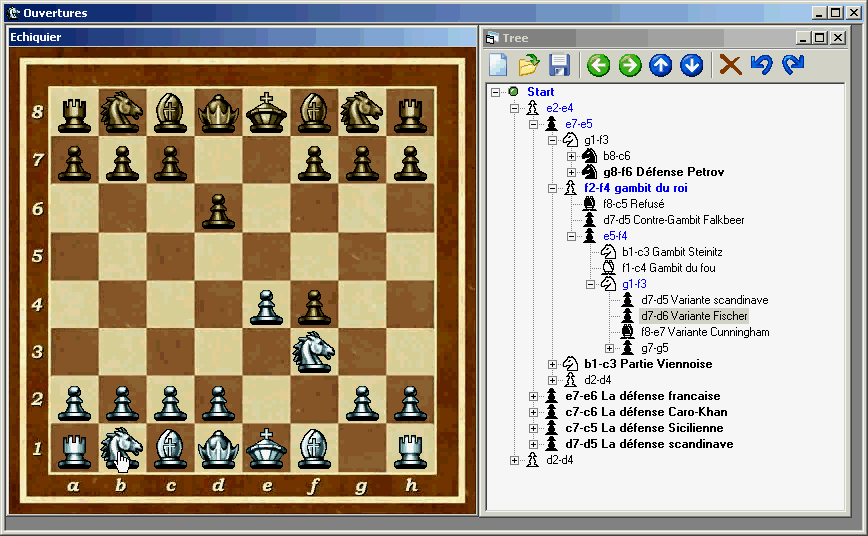



## Chess board

### Description

All the move make on the chess board (By Drag&Drop) was report on the tree view, and a clic on a node set the chess board on this position.

usefull to pratice chess opening book

See the screen shot

(Sorry for my english I m french)
 
### More Info
 

             |
---                |---
**Submitted On**   |2002-07-03 16:18:14
**By**             |[FredJust](https://github.com/Planet-Source-Code/PSCIndex/blob/master/ByAuthor/fredjust.md)
**Level**          |Intermediate
**User Rating**    |4.7 (61 globes from 13 users)
**Compatibility**  |VB 6\.0
**Category**       |[Games](https://github.com/Planet-Source-Code/PSCIndex/blob/master/ByCategory/games__1-38.md)
**World**          |[Visual Basic](https://github.com/Planet-Source-Code/PSCIndex/blob/master/ByWorld/visual-basic.md)
**Archive File**   |[Chess\_boar102694762002\.zip](https://github.com/Planet-Source-Code/fredjust-chess-board__1-36627/archive/master.zip)

